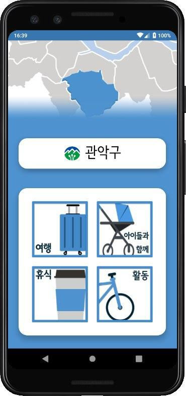
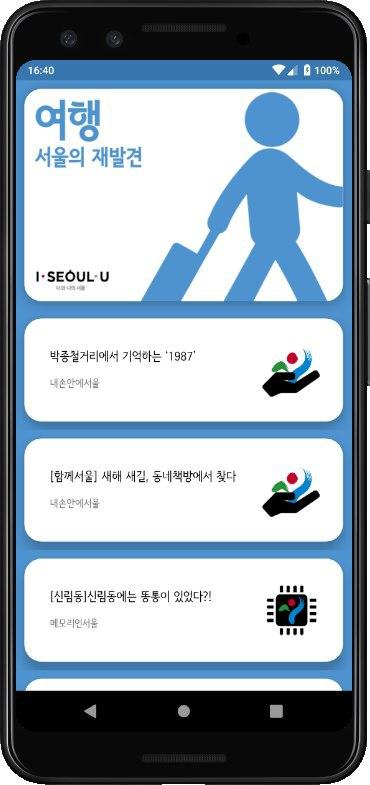
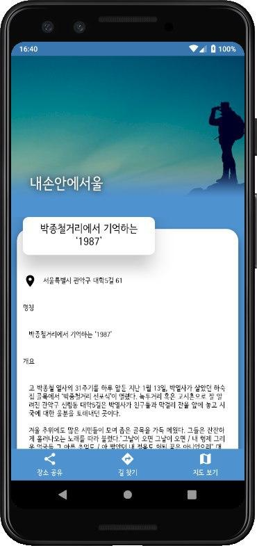

# Soul Rest : 서울에서 소울을 힐링하다
### 2019 스마트서울 모바일 앱공모전 장려상 수상작

</img>
</img>
</img>

서울시에 위치한 소울을 힐링할 수 있는 각종 명소들을
주제별, 자치구별로 분류해 제공하는 애플리케이션입니다.

***

### 개발자 정보
#### Team Def:Con
* 유용민 : 중앙대학교 소프트웨어학부 19학번 재학중
* 김영현 : 안양대학교 컴퓨터공학과 19학번 재학중
* 정승민 : 대림대학교 컴퓨터정보학부 19학번 재학중